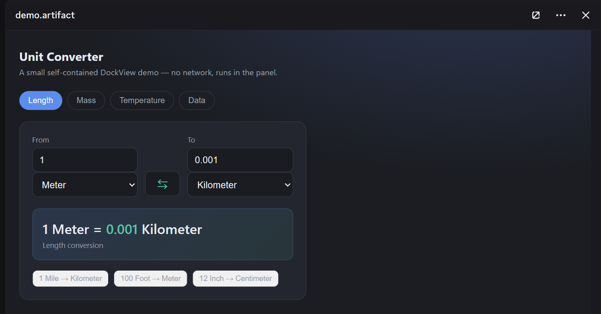

# Vesktop · DockView panel

A build of [Vesktop](https://github.com/Vencord/Vesktop) with the **DockView**
side panel bundled in — open PDFs, Office docs, code, data, diagrams, notebooks,
and interactive files in a panel right inside Discord.

## What is this

This is **Vesktop** — the lightweight Discord desktop app — with the **DockView**
side panel built in. Click any attachment in chat and it opens in a panel docked
to the side of the window, so you can read a PDF or look at a screenshot without
leaving the conversation. Everything else is exactly the Vesktop you know;
DockView just adds the side panel on top.

Install it, sign in. That's the whole setup.

## Features

- **PDFs** — read inline with page navigation, zoom, selectable text, and find-in-document.
- **Images** — open in the panel with zoom and pan; double-click to fit or go 1:1.
- **Office documents** — Word (`.docx`) and Excel (`.xlsx`/`.xls`) render in the panel; spreadsheets become a grid.
- **Data** — CSV/TSV as a grid; JSON/XML as a collapsible tree.
- **Code & text** — syntax highlighting, line numbers, word-wrap toggle, one-click copy.
- **Markdown & notebooks** — Markdown and Jupyter `.ipynb` rendered properly, with highlighted code.
- **Diagrams** — Mermaid and Graphviz/`.dot` render as diagrams.
- **Interactive HTML** — self-contained HTML artifacts run sandboxed right in the panel.
- **The panel itself** — sits where the thread/member sidebar goes, resizes by dragging its edge, and each channel remembers the file you had open.

Nothing loads until you click an attachment, and the normal download button still works exactly as before.

## Why

If you spend time in Discord sharing lecture notes, documents, screenshots, or
code snippets, you know the routine: download the file, alt-tab to another app,
read it, come back. DockView keeps all of that in one window. Keep chatting on
the left, read the file on the right.

## Install

**The app (recommended).** [Download the latest release](https://github.com/ksia2003/discord-dockview/releases/latest) and run the installer for your system:

- **Windows** — `Vesktop-Setup-*.exe`
- **Linux** — `.AppImage`, `.deb`, `.rpm`, or `.tar.gz`

Install, launch, log in to Discord. There's nothing else to set up — the side panel is built in. It installs as Vesktop (same app identity), so if you already run Vesktop it just becomes this build.

**Already running Vesktop?** Grab the `DockView-Vencord-*.zip` bundle from the release, unzip it, and run the included installer — `install-dockview.sh` on Linux, `install-dockview.ps1` on Windows. It drops DockView's Vencord build into Vesktop's custom-Vencord folder; restart Vesktop and the panel is there. This replaces your Vencord with ours (which is stock Vencord plus DockView, so your existing Vencord plugins keep working).

**Building from source:** the side panel is one Vencord userplugin under [`plugin/`](plugin/). `pnpm prepareVencord` clones Vencord, drops the plugin in, installs the viewer dependencies it imports (derived automatically from the source, never hand-maintained), and builds the four `vencordDesktop*` files. `pnpm package` wraps those into the installers above; `pnpm package:bundle` into the drop-in zip.

## Notes

- Desktop only. There's no mobile or web version.
- macOS isn't supported right now.

## Project layout

The fork is mostly upstream Vesktop. Everything DockView adds is one Vencord
userplugin under [`plugin/`](plugin/), organized so each folder's name tells you
what it does:

- **`engine/`** — the format-agnostic dock core: window/tab state, the content cache, load routing, content-type detection.
- **`host/`** — Discord integration: mounting into the chat layout, panel sizing, sidebar exclusivity.
- **`ui/`** — the dock chrome: the tab strip, header controls, find bar, state cards.
- **`viewers/`** — one self-contained module per file format (pdf, image, code, csv, json/xml tree, and the doc/iframe family: markdown, html, docx, xlsx, mermaid, graphviz, ipynb). Adding a format is one new module plus one line in the registry.
- **`edit/`**, **`external/`**, **`mcp/`** — in-panel editing, pop-out windows, and the (parked) MCP bridge.

## Built on / License

This is a fork of [Vesktop](https://github.com/Vencord/Vesktop) that bundles
[Vencord](https://github.com/Vendicated/Vencord) plus the DockView side-panel
plugin. All credit for the underlying Discord desktop app and client mod goes to
Vendicated and the Vesktop / Vencord contributors.

Licensed under **GPL-3.0-or-later**, the same as its upstream projects. All
original copyright notices and license headers are kept intact.
