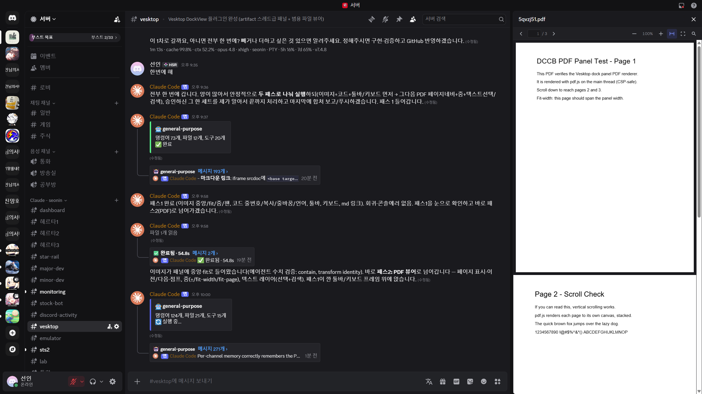
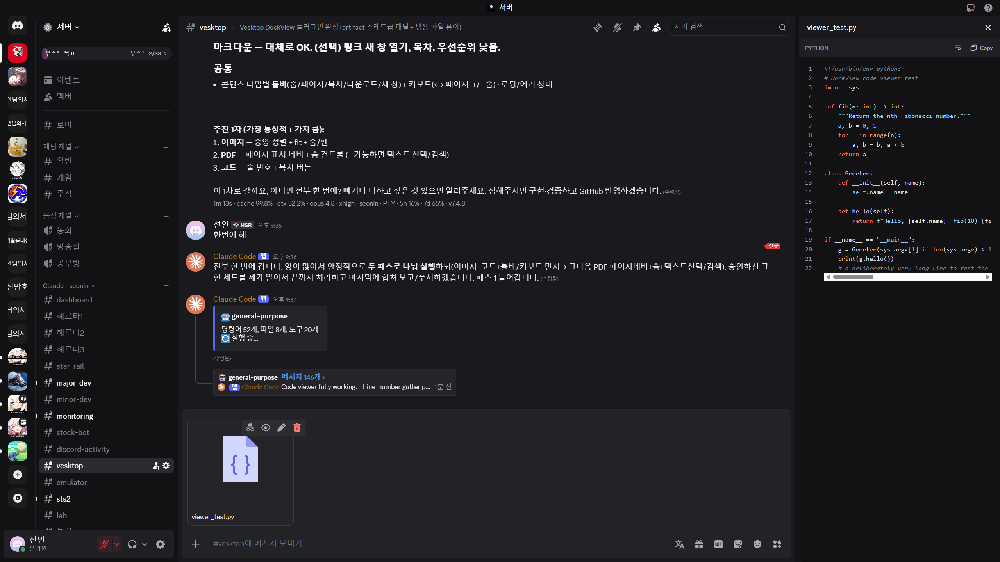
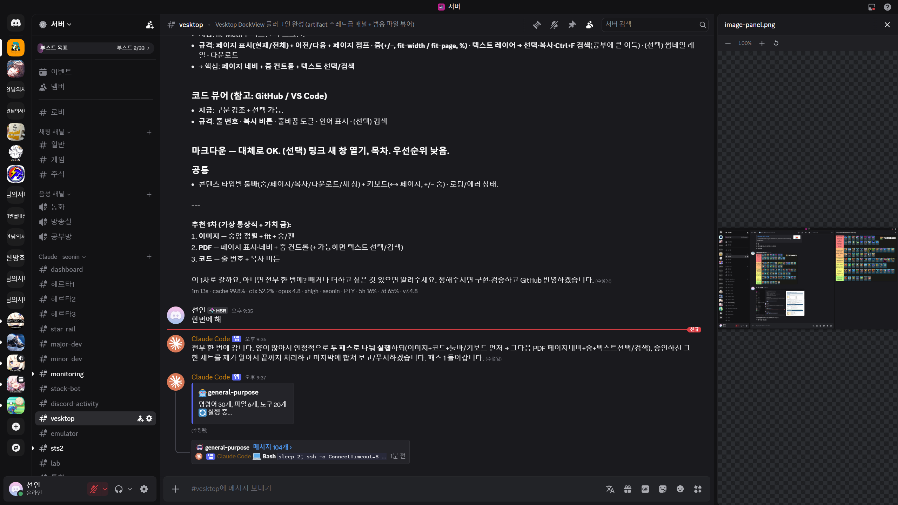
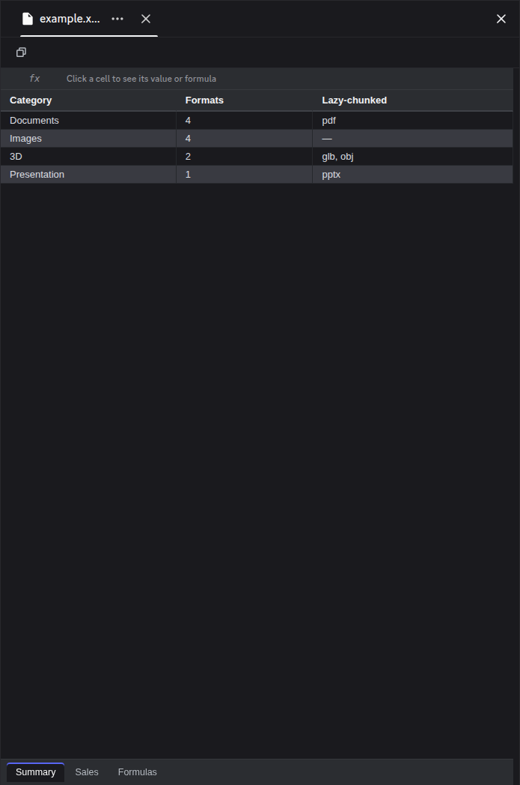
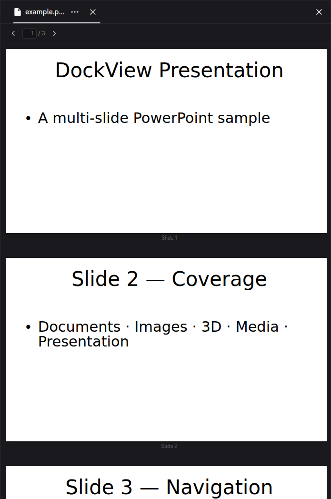
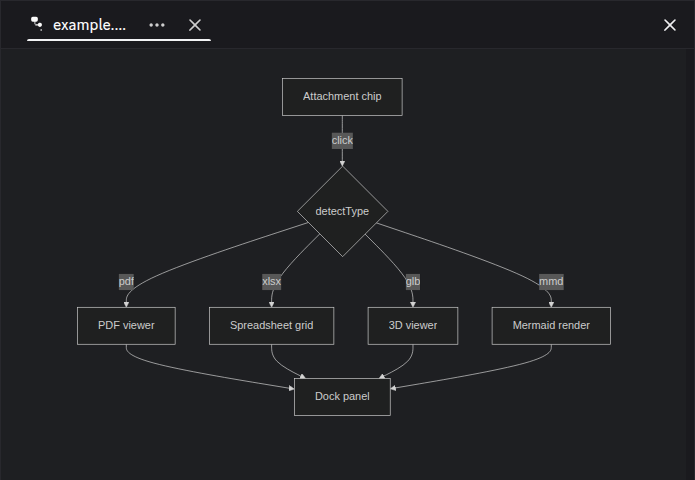
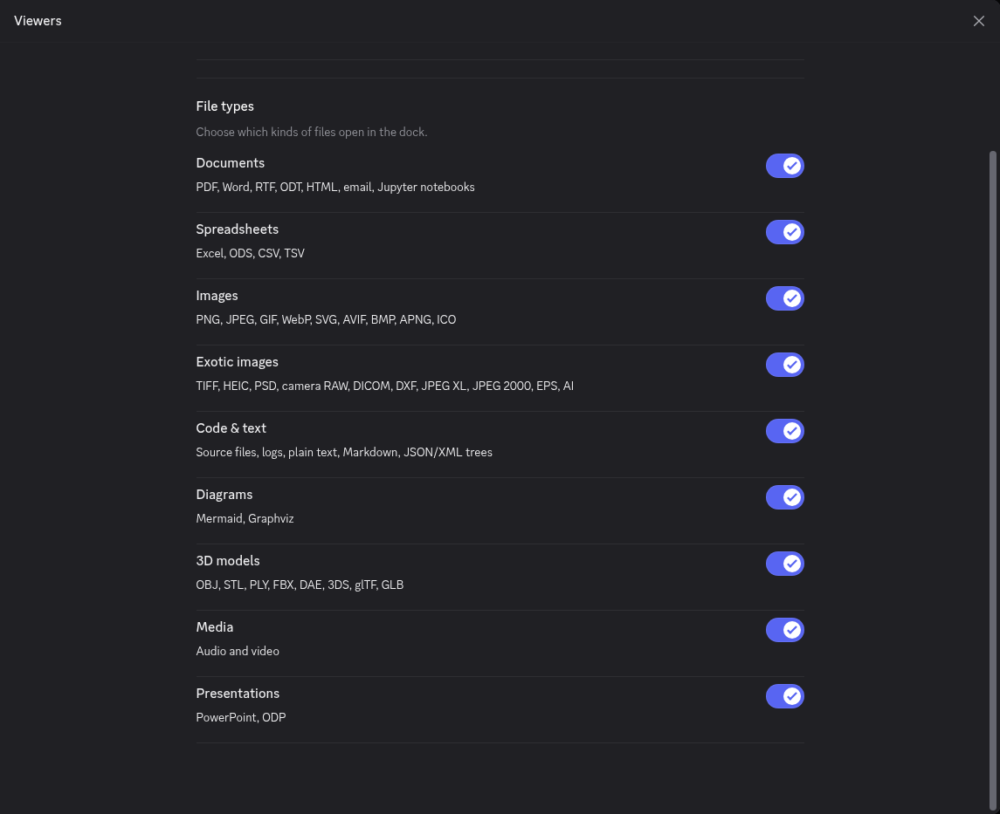
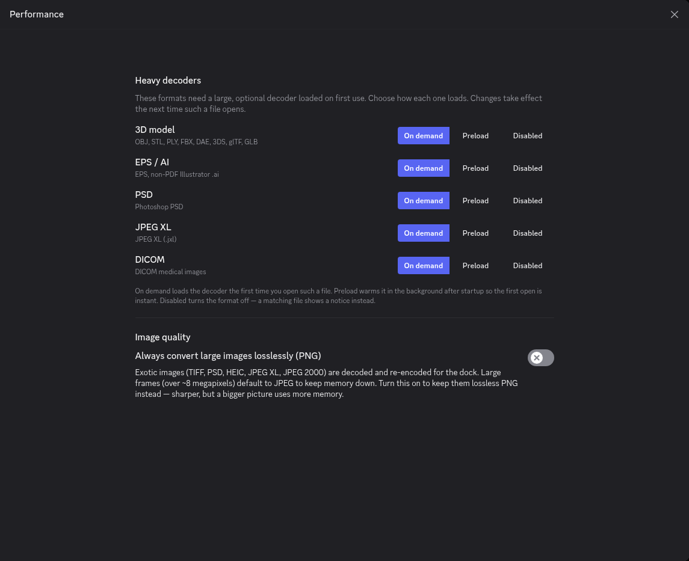

# Vesktop · DockView panel

A build of [Vesktop](https://github.com/Vencord/Vesktop) with the **DockView**
side panel bundled in — open PDFs, Office docs, code, data, diagrams, notebooks,
3D models, and interactive files in a panel right inside Discord.



## What is this

This is **Vesktop** — the lightweight Discord desktop app — with the **DockView**
side panel built in. Click any attachment in chat and it opens in a panel docked
to the side of the window, so you can read a PDF or look at a screenshot without
leaving the conversation. Everything else is exactly the Vesktop you know;
DockView just adds the side panel on top.

If you spend time in Discord sharing lecture notes, documents, screenshots, or
code snippets, you know the routine: download the file, alt-tab to another app,
read it, come back. DockView keeps all of that in one window — keep chatting on
the left, read the file on the right.

Install it, sign in. That's the whole setup. Nothing loads until you click an
attachment, and the normal download button still works exactly as before.

It's a real, everyday-usable build — the format coverage below is what it does
today — but it's still evolving, so expect the occasional rough edge and the odd
breaking change between releases.

## The panel

The dock sits where the thread/member sidebar goes and resizes by dragging its
edge. Each channel remembers the file you had open, so switching channels brings
its file back. Files open in their own viewer with the controls that make sense
for the format — page navigation for a PDF, a sheet switcher for a spreadsheet,
orbit controls for a 3D model.

<table>
<tr>
<td width="50%"></td>
<td width="50%"></td>
</tr>
<tr>
<td width="50%"></td>
<td width="50%"></td>
</tr>
</table>

A few things worth knowing:

- **PDFs** read inline with page navigation, zoom, selectable text, and
  find-in-document.
- **Images** open with zoom, pan and rotate; double-click to fit or go 1:1, and
  the arrow keys step through a channel's images like the native lightbox.
- **Code** gets syntax highlighting, line numbers, a word-wrap toggle, one-click
  copy, and a "copy line reference" that pastes a `file L12-L20` link into chat.
- **Markdown** renders with a table-of-contents toggle and copy buttons on code
  fences; **spreadsheets** show a grid with a formula bar and any embedded charts.
- **Diagrams** (Mermaid, Graphviz) and **3D models** render live in the panel.



## Settings

DockView has its own section in Discord's settings, at the same level as Vencord
Settings, with a page for each area:

<table>
<tr>
<td width="50%"></td>
<td width="50%"></td>
</tr>
</table>

- **General** — dock width, whether the member list collapses while the dock is
  open, media autoplay, and per-channel memory.
- **Viewers** — a master switch plus one toggle per file-type category, so you
  can turn off any kind of file you'd rather have behave like stock Discord.
- **Performance** — how the heavy, optional decoders (3D, PSD, JPEG XL, DICOM,
  EPS/AI) load: on demand, preloaded in the background, or off.
- **Privacy** — whether email previews load remote images (off by default,
  because a remote image in an email is usually a tracking pixel).
- **Examples** — a gallery that opens a representative sample of every viewer
  right in the dock, so you can try them without hunting for a test file.

## Profiles & account switching

DockView adds a **Profiles** page for running more than one account. Each profile
is a completely separate login with its own settings — **Switch** replaces the
current window with another profile (one window, both stay signed in, no
re-login), and **Open** puts a second profile in its own window beside the first.
There are no tokens to paste and no shared session, so the settings collisions
that plague token-swapper setups can't happen.

Profiles are a desktop app-shell feature, so they need the installer (they're not
part of the panel-only in-app update).

## Updates

DockView keeps itself current. Once a day it quietly checks GitHub for a newer
build and, if one is ready, shows a small notice — it never installs anything on
its own. To update, open **DockView settings → Updates**, hit **Check for
updates**, then **Apply**. The panel swaps itself in place; no app reinstall.

That in-app path covers panel and viewer changes. Changes to the app shell itself
(the Profiles feature, tray menus, window handling) need the installer — the
Updates page and the release notes say when that's the case.

## Install

**The app (recommended).** [Download the latest release](https://github.com/ksia2003/discord-dockview/releases/latest)
and run the installer for your system:

- **Windows** — `Vesktop.Setup.*.exe`
- **Linux** — `.AppImage`, `.deb`, `.rpm`, or `.tar.gz` (x64 and arm64)

Install, launch, log in to Discord. There's nothing else to set up — the side
panel is built in. It installs as Vesktop (same app identity), so if you already
run Vesktop it just becomes this build.

**Already running Vesktop?** The panel is a Vencord build, so you can point
Vesktop's custom-Vencord folder at it instead of reinstalling. Grab the plugin
bundle files from the release — the four `vencordDesktop*` files, `version.txt`,
and the `chunk-*.js` files — drop them into a folder, and set that folder as your
custom Vencord location in **Vesktop settings → Developer → Custom Vencord
location**, then restart. (The installer route is simpler and gets you the
Profiles/tray features too; this is the power-user path.)

## Formats

DockView renders essentially everything the client can display. Files route by
extension; anything it can't preview keeps Discord's normal download behaviour.

| Category | Formats |
| --- | --- |
| **Documents** | PDF · Word `.docx` · Rich Text `.rtf` · OpenDocument Text `.odt` · self-contained HTML `.html`/`.htm` · email `.eml`/`.msg` · Jupyter `.ipynb` |
| **Spreadsheets** | Excel `.xlsx`/`.xls`/`.xlsm` · OpenDocument `.ods` · `.csv`/`.tsv`/`.tab` |
| **Images** | `.png` · `.jpg`/`.jpeg` · `.gif` · `.webp` · `.bmp` · `.svg` · `.apng` · `.avif` |
| **Exotic images** | `.tiff`/`.tif` (multi-page) · `.heic`/`.heif` · Photoshop `.psd` · Targa `.tga` · icons `.ico`/`.cur` · JPEG 2000 `.jp2`/`.jpx`/`.j2k`/`.j2c` · JPEG XL `.jxl` · camera RAW `.cr2`/`.nef`/`.dng`/`.arw`/`.raf`/`.orf`/`.rw2` · DICOM `.dcm`/`.dicom` · AutoCAD `.dxf` · PostScript `.eps` · Illustrator `.ai` |
| **Code & text** | ~70 source & config extensions (`.js`/`.ts`, `.py`, `.c`/`.cpp`, `.rs`, `.go`, `.java`, `.rb`, `.php`, `.sh`, `.sql`, `.yml`, `.toml`, `.css`, …) · plain text & logs · Markdown `.md`/`.markdown` · JSON `.json`/`.json5` & XML `.xml` trees |
| **Diagrams** | Mermaid `.mmd`/`.mermaid` · Graphviz `.dot`/`.gv` |
| **3D** | `.obj` · `.stl` · `.ply` · `.fbx` · `.dae` · `.3ds` · glTF `.gltf`/`.glb` |
| **Media** | audio (`.mp3`, `.wav`, `.m4a`, `.aac`, `.ogg`, `.opus`, `.flac`, …) · video (`.mp4`, `.m4v`, `.webm`, `.mov`, …) |
| **Presentations** | PowerPoint `.pptx` · OpenDocument `.odp` |

**What it can't do.** A handful of formats have no open reader that runs in the
app, so they keep Discord's download button rather than showing a broken preview:
the legacy binary `.doc`/`.ppt` (their modern `.docx`/`.pptx`/`.xls` twins all
work), Apple iWork (`.pages`/`.numbers`/`.key`), InDesign `.indd`, and AutoCAD
`.dwg`. Compressed DICOM shows an honest notice instead of a garbled image.

## Building from source

The side panel is one Vencord userplugin under [`plugin/`](plugin/). The rest of
the repo is upstream Vesktop.

```bash
pnpm prepareVencord   # clone Vencord, drop the plugin in, install its viewer deps, build
pnpm build            # build the Vesktop renderer + main
pnpm package          # wrap the build into installers
```

`prepareVencord` derives the viewer dependencies straight from the plugin source
(never hand-maintained) and builds the four `vencordDesktop*` files. The heavy
viewer libraries (PDF.js, three.js, mermaid, …) ship as out-of-bundle `chunk-*.js`
files loaded on demand, to keep startup fast.

### Development

The plugin is organised so each folder's name tells you what it does:

- **`engine/`** — the format-agnostic core: window/tab state, the content cache,
  load routing, content-type detection.
- **`host/`** — Discord integration: mounting into the chat layout, panel sizing,
  sidebar exclusivity.
- **`ui/`** — the dock chrome (tab strip, header controls, find bar, state cards)
  and the settings pages.
- **`viewers/`** — one self-contained module per format.
- **`edit/`**, **`external/`**, **`mcp/`** — in-panel editing, pop-out windows,
  and the (parked) MCP bridge.

**Adding a viewer** is one new module plus three registrations: add the module
under `viewers/<fmt>/`, register it in `viewers/registry.ts`, map its extensions
in `engine/detectType.ts`, and give its content type a category in
`engine/categoryMap.ts` (the compiler enforces that last one). Every user-visible
string lives in `plugin/strings.ts`.

## Built on / License

This is a fork of [Vesktop](https://github.com/Vencord/Vesktop) that bundles
[Vencord](https://github.com/Vendicated/Vencord) plus the DockView side-panel
plugin. All credit for the underlying Discord desktop app and client mod goes to
Vendicated and the Vesktop / Vencord contributors.

Licensed under **GPL-3.0-or-later**, the same as its upstream projects. All
original copyright notices and license headers are kept intact.
